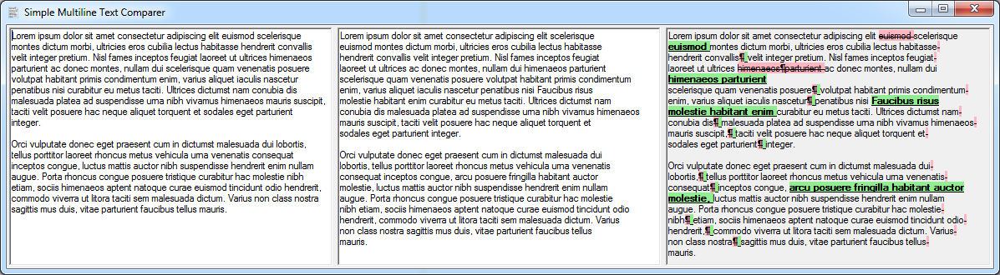

# Formatted Text Diff

## Introduction

**Formatted Text Diff** is a simple application that is designed to compare two texts. There are many applications that allow this, but mostly only on a line base. But when the text formatting changes *(new paragraphs were added, or line width was changed, or new inserted word caused moving another words to next line)*, these applications return too many changes.

**Formatted Text Diff** displays changes even between lines, even when the words were moved to another line.

## Know restrictions

* big memory usage _(compare of two 10,000 characters texts requires more than 500 MB of RAM)_,
* no highlight colours in Linux _(probably caused by implementation of `RichTextBox` in Linux)_

## License

This software is released under the [MIT License](https://opensource.org/licenses/MIT).
